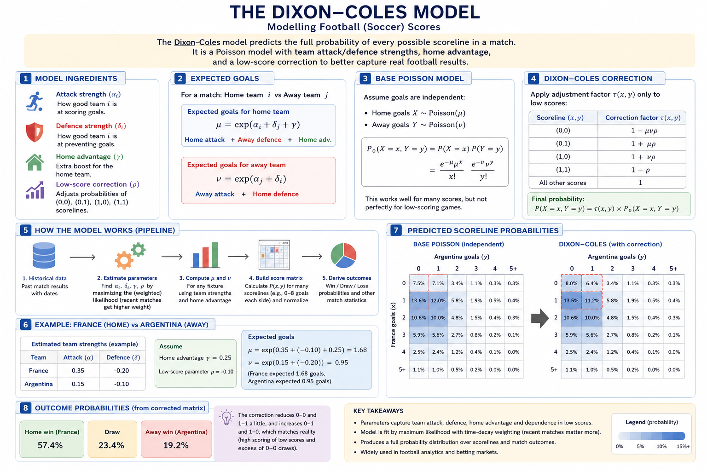

# WC 2026 Match Prediction Engine

A statistical match prediction system for **FIFA World Cup 2026** (June 11 – July 19, 2026).

Predicts match outcomes, expected goals, scorelines, over/under, and BTTS using a
**Dixon-Coles Poisson model** + **Elo ratings**, trained on 50k+ historical international matches
and updated live with WC 2026 results as they come in.
---

## How the Dixon-Coles Model Works

The prediction engine relies on the **Dixon-Coles Poisson model**, an established statistical framework for predicting football scores.



At its core, the model calculates two main components for every match:
1. **Expected Goals (xG)**: It estimates the expected number of goals for the home team ($\mu$) and away team ($\nu$) based on their historical attack and defense strengths, adjusted for the overall global average and venue/host advantage.
2. **Poisson Distribution**: It uses the Poisson probability distribution to convert these expected goal values into probabilities for every possible exact scoreline (e.g., 1-0, 2-1, 0-0).

Unlike a basic independent Poisson model, Dixon-Coles introduces a **correlation parameter ($\rho$)** to adjust for the fact that low-scoring matches (0-0, 1-0, 0-1, 1-1) occur more frequently in reality than standard Poisson equations predict. 

The engine fits this model to 50,000+ historical international matches, applying a time-decay function (half-life of 180 days) so that recent matches influence the parameters much more than matches from 3–5 years ago.

---

## Model accuracy improvements

| Setting | Value | Rationale |
|---|---|---|
| Half-life | **180 days** | Weights recent 6-month form 2× over older results |
| Cutoff window | **6 years** (2020–present) | Squad generations turn over; older data adds noise |
| Min tournament weight | **0.8** | Drops most friendlies — only competitive matches used |
| Elo K-factor | **32** | Slightly more responsive than default 30 |
| WC 2026 live results | **weight 2.0** | Maximum signal from in-tournament results |
| Host advantage | **USA / Canada / Mexico** | Receive home advantage, not neutral venue |

---

## Workflow

### First-time setup

```bash
cd /home/koala/portfolio/world_cup

# Install dependencies
uv sync
uv pip install -e .

# Step 1: Process raw data (once)
uv run python -m src.data.loader

# Step 2: Train models
uv run python -m src.pipeline.train --refresh
```

### Daily (during the tournament)

```bash
# Re-train on overnight results, then predict today's matches
uv run python -m src.pipeline.train --refresh
uv run python -m src.pipeline.live
```

---

## Data setup (Step 1)

The model trains on ~50k international match results since 1872.

**Download from Kaggle:**

1. Go to: https://www.kaggle.com/datasets/martj42/international-football-results-from-1872-to-2017
2. Download and unzip
3. Place `results.csv` here: `data/raw/results.csv`

**Or use the Kaggle CLI:**

```bash
kaggle datasets download -d martj42/international-football-results-from-1872-to-2017
unzip international-football-results-from-1872-to-2017.zip -d data/raw/
```

Then process it:

```bash
uv run python -m src.data.loader
# → data/processed/matches.parquet
```

> Only needs to run once, unless you update the raw file.

---

## Training (Step 2)

Fits Dixon-Coles and Elo on historical + live WC 2026 data:

```bash
uv run python -m src.pipeline.train           # fit using cached results
uv run python -m src.pipeline.train --refresh  # fetch latest WC results first (recommended)
```

Options:

```bash
--cutoff 5       # Use only last 5 years (faster, slightly less accurate)
--min-weight 1.0 # Major tournaments only (WC, Euros, Copa América)
```

Output:

```
outputs/models/
├── dixon_coles.pkl    ← fitted Dixon-Coles model
├── elo.pkl            ← fitted Elo rating system
└── train_meta.txt     ← training metadata
```

---

## Predictions (Step 3)

```bash
# Today's matches
uv run python -m src.pipeline.live

# Specific date
uv run python -m src.pipeline.live --matchday 2026-06-16

# All remaining group stage
uv run python -m src.pipeline.live --all

# Force re-train then predict
uv run python -m src.pipeline.live --refresh --train
```

---

## Output

**Terminal:**

```
────────────────────────────────────────────────────────────
                        Canada 🏠  vs  Bosnia and Herzegovina
  2026-06-13   (Elo: 1830 vs 1500  diff: +330)
────────────────────────────────────────────────────────────
  Result:  Canada win 91%  |  Draw 7%  |  Bosnia and Herzegovina win 2%
  Goals:   xG 3.41–0.40  |  O2.5 90%  |  BTTS 32%
  Top scorelines: 3-0(15%)  2-0(13%)  4-0(13%)
```

> 🏠 marks host nations (USA / Canada / Mexico) receiving home advantage.

**JSON** saved to `outputs/predictions/YYYY-MM-DD_predictions.json`:

```json
{
  "match": {
    "home_team": "Canada",
    "away_team": "Bosnia and Herzegovina",
    "date": "2026-06-13",
    "neutral_venue": false,
    "host_advantage": true
  },
  "elo": {
    "home_elo": 1830.1,
    "away_elo": 1500.0,
    "elo_diff": 330.1
  },
  "match_outcome": { "home_win": 0.913, "draw": 0.0695, "away_win": 0.0175 },
  "goals": {
    "expected_home_goals": 3.41,
    "expected_away_goals": 0.401,
    "over_2_5": 0.903,
    "under_2_5": 0.097,
    "btts": 0.322
  },
  "top_scorelines": [[3,0,0.1475],[2,0,0.1297],[4,0,0.1257],[5,0,0.0857],[1,0,0.0738]]
}
```

### What the numbers mean

| Field | Source | Description |
|---|---|---|
| `home_win / draw / away_win` | Dixon-Coles | Probabilities from the full 9×9 scoreline matrix |
| `expected_home/away_goals` | Dixon-Coles | μ and ν — the Poisson rate parameters |
| `over_2_5 / under_2_5` | Dixon-Coles | Sum of scoreline matrix anti-diagonals |
| `btts` | Dixon-Coles | P(both teams score ≥ 1) |
| `top_scorelines` | Dixon-Coles | `[home_goals, away_goals, probability]` — top 5 most likely scores |
| `host_advantage` | predict.py | True when USA/Canada/Mexico is home — `neutral_venue` set to False |
| `elo_diff` | Elo | Home Elo minus away Elo; positive = home team favoured by Elo |

---

## Backtesting

Validate the model against the 2022 World Cup:

```bash
uv run python tests/backtest.py --wc 2022
```

Results saved to `tests/backtest_results.md` with log-loss, Brier score, and calibration.

---

## All CLI commands

| Command | What it does |
|---|---|
| `uv run python -m src.data.loader` | Process raw CSV → parquet (once) |
| `uv run python -m src.pipeline.train` | Fit models and save to `outputs/models/` |
| `uv run python -m src.pipeline.train --refresh` | Fetch latest WC results, then fit |
| `uv run python -m src.pipeline.live` | Predict today's matches |
| `uv run python -m src.pipeline.live --matchday 2026-06-16` | Predict a specific date |
| `uv run python -m src.pipeline.live --all` | Predict all remaining group stage |
| `uv run python tests/backtest.py --wc 2022` | Validate model vs 2022 WC |

---

## Project structure

```
world_cup/
├── data/
│   ├── raw/
│   │   ├── results.csv              ← download from Kaggle (required)
│   │   ├── wc2026_fixtures.csv      ← WC 2026 fixture list (FotMob)
│   │   ├── wc2026_results.csv       ← live results cache (auto-updated)
│   │   └── shootouts.csv            ← penalty shootout data
│   ├── processed/
│   │   └── matches.parquet          ← built by src.data.loader
│   └── SOURCES.md
├── src/
│   ├── data/
│   │   ├── loader.py                ← clean & process historical data
│   │   └── wc2026.py                ← WC 2026 fixtures + live results fetcher
│   ├── features/
│   │   └── elo.py                   ← Elo rating system
│   ├── models/
│   │   └── dixon_coles.py           ← core Dixon-Coles Poisson model
│   └── pipeline/
│       ├── train.py                 ← fit & save models ← TRAIN HERE
│       ├── live.py                  ← load models & predict ← PREDICT HERE
│       └── predict.py               ← single-match prediction helper
├── outputs/
│   ├── models/                      ← saved trained models
│   └── predictions/                 ← daily JSON predictions
├── tests/
│   └── backtest.py                  ← model validation against WC 2018/2022
├── notebooks/
│   └── exp.ipynb                    ← data exploration
└── README.md
```

---

## Limitations

| Limitation | Notes |
|---|---|
| WC 2026 sample is small | Only 2 completed matches at tournament start — model relies heavily on pre-tournament history |
| No injury / suspension awareness | Apply as manual context before trusting predictions |
| Dixon-Coles uses team-level params only | No individual player form, no lineup/formation adjustment |
| Friendlies excluded | Intentional — competitive form only (`min_weight=0.8`) |
| Elo ratings lag slightly | Ratings update after results; large upsets create temporary drift |
